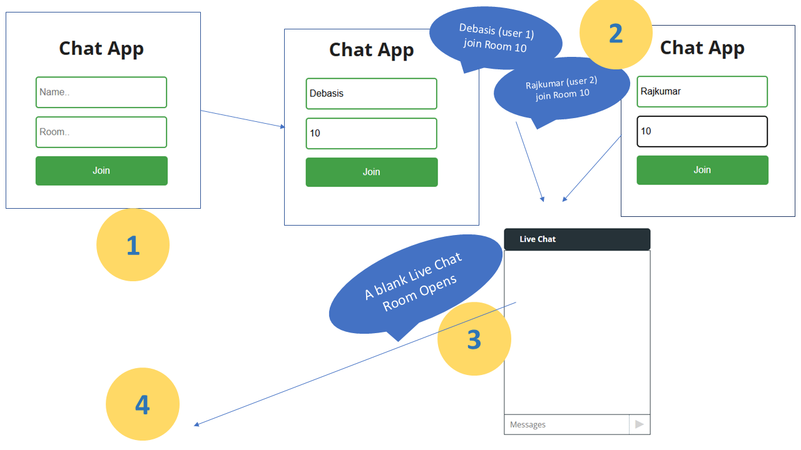
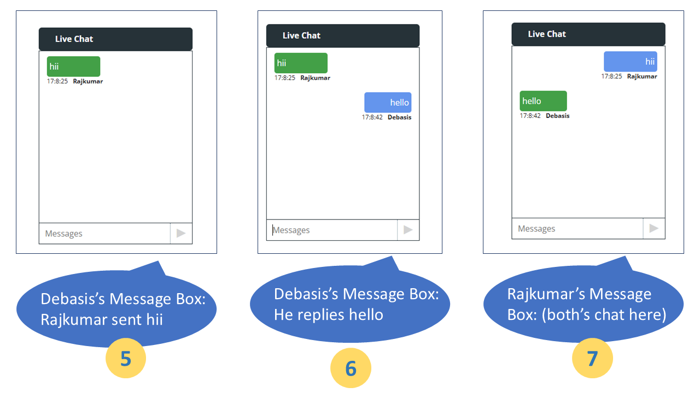

# Real Time Chat App Demonstration with WebSockets

- ```Backend (Server)``` developed in Nodejs + Express with Websockets.
  * Packages used : [socket.io](https://socket.io/docs/v4/server-api/) , cors, nodemon
- ```Frontend (Client)```  developed with Reactjs.
  * Packages used: [socket.io-client](https://socket.io/docs/v4/client-api/)
- For better more information on [sockets](https://socket.io/)


### Working Procedure ### 



